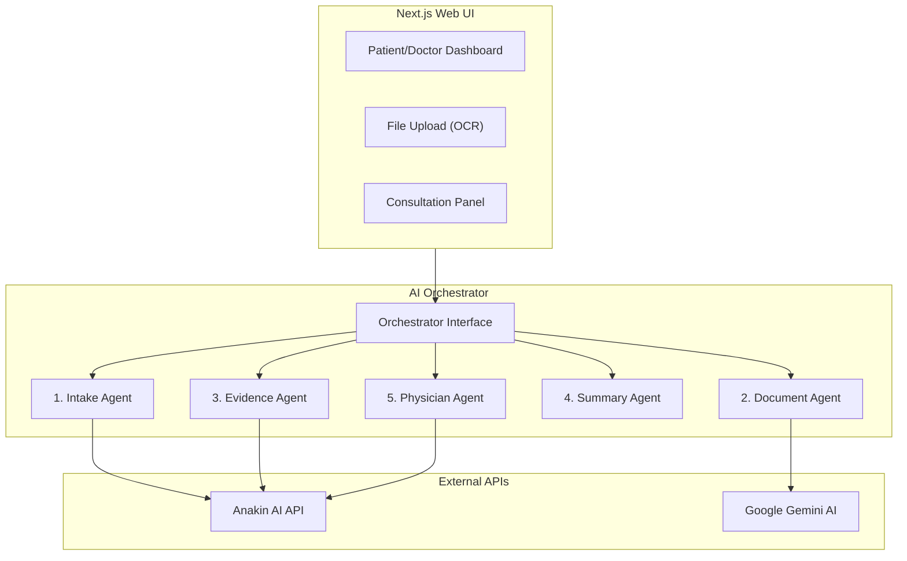

# 🏥 MedCare AI — Architecture Document

## System Overview
MedCare AI is an advanced, multi-agent AI system designed to ensure medical care continuity for pregnant patients and individuals managing chronic illnesses. It integrates clinical intake, document processing (OCR), redaction, safety checks, and clinical decision support into a cohesive platform.

## Core Layers
1. **Presentation Layer (Next.js / Tailwind CSS)**:
   - Dynamic, dark-themed dashboard.
   - Separate portals for patient intake, medical report uploads, clinical briefings, and physician consultation.
2. **Orchestration Layer (`lib/ai/orchestrator.ts`)**:
   - Manages and routes calls between the dedicated AI agents.
   - Aggregates state and clinical data context to feed into prompt systems.
3. **Agent Layer (`lib/agents/`)**:
   - Specialized agents: **Intake**, **Document**, **Evidence**, **Summary**, and **Physician**.
4. **Integration Layer (`lib/anakin/` & `lib/ocr/`)**:
   - `client.ts`: Connects to Anakin AI Quick Apps and Chatbot Endpoints.
   - `extractor.ts`: Performs document text extraction (OCR).
   - `parser.ts`: Parses clinical text fields.
