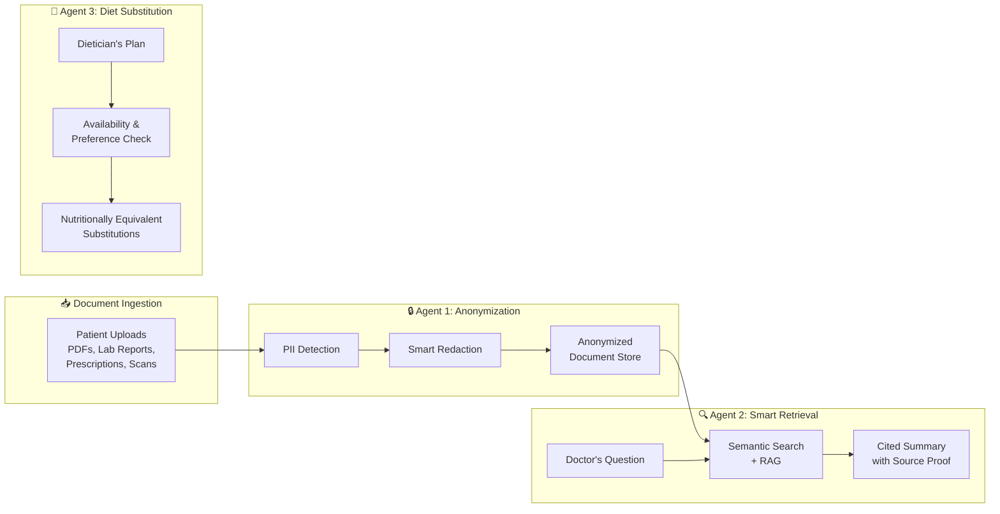
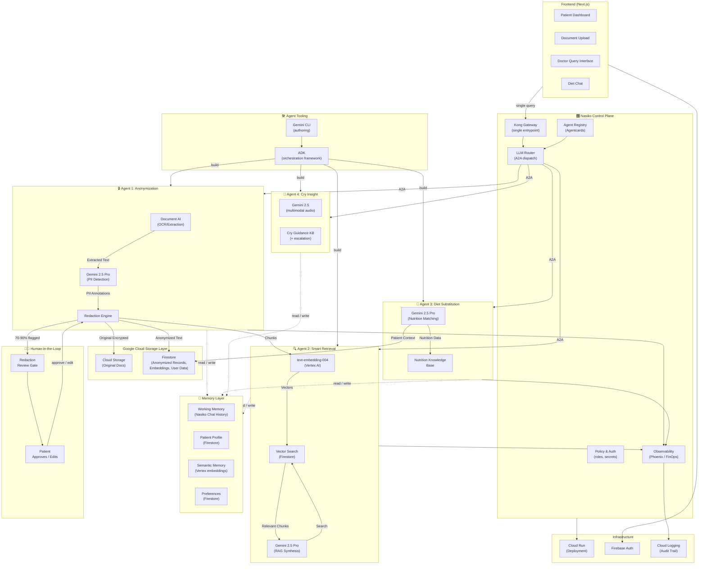

# 🏥 MedSync AI — Implementation Plan (v3)

> **Agent Arena Bangalore 2026 | Track B: Enterprise Agent Engineering**
> A **Nasiko-orchestrated, 3-agent** medical continuity platform for pregnant women and chronic illness patients.
> **Workflow:** `Gemini CLI + ADK → Nasiko (control plane) → Cloud Run`

---

## Architecture: The 3-Agent Pipeline



---

## 🎛️ The Orchestrator: Nasiko Control Plane

### Why an Orchestrator?
Three specialized agents are only as good as the layer that coordinates them. A patient or doctor doesn't know (or care) *which* agent answers — they ask one question (*"summarize my diabetes history"* / *"swap quinoa for something local"*) and expect the system to route it to the right specialist, enforce access policy, and prove what it did. That coordination layer is the **Orchestrator**, and we implement it with **[Nasiko](https://www.nasiko.com/) — an open-source Developer Control Plane for AI agents.**

This is the heart of **Track B: Enterprise Agent Engineering** and the literal Track B workflow: **`Gemini CLI + ADK → Nasiko → Cloud Run`**.

### What Nasiko Gives Us (its 4 pillars → our use)

| Nasiko Pillar | What it does | How MedSync uses it |
|---|---|---|
| **Registry & Discovery** | Catalogs agents via A2A capability cards + versioning | Each of our 3 agents is registered with an `Agentcard.json`; new agents (e.g. a future *Medication-Interaction* agent) plug in without touching the frontend |
| **Router (intelligent routing)** | LLM picks the right agent for a query, forwards via Kong, streams the response | A single `/router` endpoint receives *any* patient/doctor query and dispatches to Anonymizer, Retriever, or Diet agent — no hardcoded `if/else` |
| **FinOps & Observability** | Real-time token usage, latency, retries, cost; Phoenix tracing | Audit-grade trace of every agent call (critical for a **medical** product) + per-request cost visibility for the demo |
| **Policy & Security** | Centralized access control, credential mgmt, declarative policies | Doctor vs. patient roles enforced at the control plane; Gemini/Vertex API keys injected, never in agent code |

### How It Works

```
              Patient / Doctor (Next.js UI on Cloud Run)
                          │  one question, one endpoint
                          ▼
        ┌─────────────────────────────────────────────┐
        │   NASIKO CONTROL PLANE                        │
        │                                              │
        │   Kong Gateway (:9100)  ── single entrypoint │
        │        │                                     │
        │   Router (:8081)  ── LLM picks the agent ────┼──► structured output: { agent: "retriever" }
        │        │                                     │
        │   Registry/Backend (:8000) ── A2A cards ─────┤
        │        │                                     │
        │   Observability (Phoenix) ── traces/cost ────┤
        │   Auth (:8082) ── role + credential policy ──┤
        └────────┬──────────────┬──────────────┬───────┘
                 ▼              ▼              ▼
        ┌──────────────┐ ┌──────────────┐ ┌──────────────┐
        │ 🔒 Anonymizer│ │ 🔍 Retriever │ │ 🥗 Diet Agent│   ← 3 A2A agents
        │  (A2A :5000) │ │  (A2A :5000) │ │  (A2A :5000) │     each in its own container
        └──────────────┘ └──────────────┘ └──────────────┘
              built with Gemini CLI + ADK, deployed to Cloud Run
```

1. The Next.js UI calls **one** Nasiko endpoint (`/router`) instead of three separate `/api/*` routes.
2. Nasiko's **Router** fetches the agent registry and uses an LLM with **structured output** to pick the target agent (`anonymizer` | `retriever` | `diet`). With <15 agents it routes via LLM directly; beyond that it falls back to embedding-based vector selection.
3. The request is forwarded over the **A2A protocol** through Kong to the chosen agent's container.
4. The agent (built with **ADK**, scaffolded via **Gemini CLI**) runs its Gemini/Vertex logic and streams a response back.
5. **Phoenix tracing** records the full span (tokens, latency, cost) — our audit trail.

### Each Agent as an A2A Service

Every agent lives in `agents/<name>/` and exposes:

```
agents/retriever/
├── Agentcard.json        # A2A capability card (name, description, skills, I/O schema)
├── Dockerfile            # containerization
├── docker-compose.yml
└── src/__main__.py       # ADK agent entrypoint, serves A2A on :5000
```

**Example `Agentcard.json`** (drives Nasiko's routing decision):

```json
{
  "name": "retriever",
  "description": "Answers clinical questions about a patient's history using RAG over anonymized records, returning a cited summary with source proof.",
  "version": "1.0.0",
  "capabilities": { "streaming": true },
  "skills": [
    {
      "id": "clinical_qa",
      "description": "Retrieve and summarize patient medical history with citations",
      "examples": [
        "What is the patient's diabetes management history?",
        "Any history of allergic reactions?",
        "Pregnancy complications in previous pregnancies?"
      ]
    }
  ]
}
```

The `description` + `examples` are exactly what the Router's LLM reads to route a query — so writing good agent cards *is* the orchestration logic.

### Deploy & Run (Track B workflow)

```bash
# 1. Scaffold + iterate each agent locally with Gemini CLI + ADK
gemini   # interactive agent authoring
adk run agents/retriever          # local A2A dev server on :5000

# 2. Register + deploy each agent into the Nasiko control plane
#    (Redis-stream deploy: builds image, injects Phoenix tracing, registers with Kong + backend)
docker exec redis redis-cli XADD orchestration:commands '*' \
  command deploy_agent \
  agent_name retriever \
  agent_path /app/agents/retriever \
  base_url http://nasiko-backend:8000 \
  upload_type directory

# 3. Configure the router LLM
#    ROUTER_LLM_PROVIDER=...   ROUTER_LLM_MODEL=...

# 4. Ship the whole stack (Next.js UI + Nasiko + agents) to Cloud Run
gcloud run deploy medsync-ai --source . --region=asia-south1 --allow-unauthenticated
```

> [!TIP]
> **Demo gold:** open Nasiko's observability view live and show the trace of a single doctor question fanning out to the Retriever agent — tokens, latency, and cost in real time. That visibly demonstrates "Enterprise Agent Engineering," not just three chatbots.

---

## 🧠 Memory Layer

### Why a Memory Layer?
Stateless agents re-read everything on every request and forget what the patient told them five minutes ago. A medical platform must **remember** — the patient's conditions, what a doctor already asked, and that *"the patient dislikes dalia."* The Memory Layer is the shared substrate all 3 agents read **before** acting and write **after**, keyed by `patientId` (the orchestrator passes this on every routed call).

> [!NOTE]
> **Implemented** as a standalone `memory-service/` (FastAPI, keyed by `patientId`) rather than an in-agent library, so the 3 separate agent containers share one source of truth. Agents integrate via ADK `before_agent_callback` (recall → inject a `[PATIENT MEMORY]` block) and `after_agent_callback` (consolidate → write facts). Semantic tier uses Gemini `text-embedding-004` with a deterministic fallback; persistence is a JSON volume today, swappable to Firestore. The cross-session "learns once" loop (dislike dalia in one session → skipped in the next) is verified.

### Four Tiers of Memory

| Tier | Lifespan | Store | What it holds |
|---|---|---|---|
| **1. Working memory** | Current session | Nasiko Chat History (`:8083`) | The active conversation thread (doctor's follow-ups, diet back-and-forth) |
| **2. Patient profile (long-term)** | Permanent | Firestore | Canonical structured record: conditions, allergies, current meds, pregnancy week — built up from anonymized docs + agent outputs |
| **3. Semantic memory** | Permanent | Vertex AI embeddings + vector index | Document chunks **and** past Q&A pairs, so recall works across sessions ("we discussed this last week") |
| **4. Preference memory** | Permanent | Firestore | Learned likes/dislikes & constraints (budget, region, *"no dalia"*) fed back into Agent 3 |

### How It Flows

```
   Orchestrator routes a query  (carries patientId + sessionId)
                 │
                 ▼
   ┌──────────────────────────────────────────┐
   │  READ  ← Memory Layer assembles context:  │
   │   • patient profile (Firestore)           │
   │   • relevant semantic memories (vector)   │
   │   • session history (Nasiko chat history) │
   │   • preferences (Firestore)               │
   └───────────────────┬──────────────────────┘
                        │  injected as context
                        ▼
                  Agent runs (Gemini/ADK)
                        │  produces result + new facts
                        ▼
   ┌──────────────────────────────────────────┐
   │  WRITE → Memory consolidation:            │
   │   • append turn to session history        │
   │   • upsert new profile facts              │
   │   • embed + index new Q&A                 │
   │   • update preferences ("dislikes dalia") │
   └──────────────────────────────────────────┘
```

### Patient Memory Schema (Firestore)

```json
{
  "patientId": "anon_7a3f",
  "profile": {
    "conditions": ["Type 2 Diabetes", "Gestational (28 wks)"],
    "allergies": ["Peanuts", "Shellfish"],
    "currentMeds": [{ "name": "Metformin", "dose": "500mg", "freq": "BID" }]
  },
  "preferences": { "diet": "Vegetarian", "region": "North Indian", "budget": "low", "dislikes": ["dalia"] },
  "semanticRefs": ["chunk_12", "qa_88"],
  "updatedBy": "retriever",
  "updatedAt": "2026-06-26T10:42:00Z"
}
```

### Per-Agent Use
- **Anonymizer** → writes new profile facts it discovers; never stores raw PII (only the encrypted reversible mapping).
- **Retriever** → reads profile + semantic memory for grounding; writes each Q&A back as a new semantic memory so follow-ups get faster and cited.
- **Diet** → reads preferences + conditions; writes updated preferences (the *"I don't like dalia"* loop becomes permanent, not per-session).

> [!TIP]
> **Demo line:** ask the diet agent the same thing twice across two sessions — the second time it *already knows* to skip dalia. Memory turns three agents into one assistant that learns.

---

## 🧑‍⚕️ Human-in-the-Loop (HITL): The Redaction Review Gate

### Why exactly one HITL stage?
Full autonomy is wrong for the **one** irreversible, high-stakes action in this system: **sharing a medical document.** If a name slips through anonymization, the patient's privacy is breached permanently. So we insert a single, well-placed human checkpoint — **the patient approves low-confidence redactions before any document is shared.** Everything else stays autonomous; this one gate is where a human stays accountable. (It also makes a clean "agent + human collaboration" demo beat.)

### Step-by-Step Flow

```
Agent 1 finishes PII detection
        │
        ▼
[1] Auto-redact entities with confidence > 90%
        │
        ▼
[2] Any entity at 70–90%?  ──No──►  go straight to [7] (approved & shared)
        │ Yes
        ▼
[3] Pipeline PAUSES. Document state → "NEEDS_REVIEW" in Firestore.
    Doc is NOT embedded, NOT shared, NOT visible to any doctor yet.
        │
        ▼
[4] UI shows a Review Queue. For each flagged span the patient sees:
        • the original snippet (in context)
        • detected type + confidence (e.g. "DOCTOR_NAME · 81%")
        • suggested redaction  → [Approve] [Edit] [Keep as-is]
        │
        ▼
[5] Patient decides each item (approve / edit the mask / reject the redaction)
        │
        ▼
[6] Redaction Engine applies the human-confirmed decisions (deterministic)
        │
        ▼
[7] Document state → "APPROVED". NOW: write to Memory, generate embeddings,
    make available to Agent 2 / doctors.
        │
        ▼
[8] Log every human decision (Cloud Logging + Nasiko trace) for audit.
    (Optional) feed decisions back to tune confidence thresholds.
```

### State Machine

```
UPLOADED → ANALYZING → (auto>90%) ──┐
                  │                  ├──► APPROVED → INDEXED → SHARED
                  └─(70–90% found)──► NEEDS_REVIEW ──(human)──┘
                                              │
                                              └──(human rejects all)──► HELD
```

### Implementation Notes
- **Where it lives:** the gate is enforced by the **Anonymizer agent + a Firestore `status` field**; the orchestrator (Nasiko policy layer) refuses to route a `NEEDS_REVIEW` doc to the Retriever — so the rule can't be bypassed.
- **API:**
  ```
  GET  /api/review/queue?patientId=...        → flagged entities awaiting review
  POST /api/review/decision                   → { docId, entityId, action: "approve"|"edit"|"reject", maskOverride? }
  ```
- **UX:** a "Needs Your Review" badge in the sidebar with a count; a side-by-side panel (original snippet vs. proposed redaction) with one-tap approve-all for the impatient.
- **Audit:** because every decision is logged with who/when/what, the system stays compliant and explainable — exactly what an enterprise medical product needs.

> [!TIP]
> **Demo beat (45s):** upload a doc, watch 12 entities auto-redact and **1 flagged at 81%**. The narrator: *"The AI is confident about 12 — but this one borderline doctor name, it asks Priya."* Tap **Approve** → the doc unlocks and becomes searchable. Autonomy where it's safe, a human where it matters.

---

## Agent 1: 🔒 Anonymization Agent

### Purpose
When medical documents are uploaded, this agent identifies and redacts Personally Identifiable Information (PII) before storage — ensuring compliance and safe sharing with new doctors.

### What It Detects & Redacts

| PII Category | Examples | Redaction Strategy |
|---|---|---|
| **Direct Identifiers** | Name, Aadhaar, phone, email | Full redaction → `[REDACTED_NAME]` |
| **Quasi-Identifiers** | DOB, address, employer | Generalize → age range, city-level |
| **Medical Identifiers** | MRN, insurance ID, hospital reg no. | Token replacement → `[ID_TOKEN_7a3f]` |
| **Contextual PII** | Doctor names, hospital names in notes | Configurable — redact or preserve |

### Technical Design

```
Patient uploads document (PDF/image/text)
        │
        ▼
┌─────────────────────────────┐
│  Document AI (OCR/Extract)  │  ← Google Document AI extracts text from PDFs/scans
└──────────┬──────────────────┘
           │ raw text
           ▼
┌─────────────────────────────┐
│  Gemini PII Detection       │  ← Structured output: list of PII entities with
│  (System Prompt + Schema)   │     type, location, confidence, suggested redaction
└──────────┬──────────────────┘
           │ PII annotations
           ▼
┌─────────────────────────────┐
│  Redaction Engine            │  ← Applies redactions, maintains mapping table
│  (Deterministic Logic)       │     (reversible for authorized access)
└──────────┬──────────────────┘
           │ anonymized text + metadata
           ▼
┌─────────────────────────────┐
│  Firestore + Cloud Storage   │  ← Stores: anonymized doc, original (encrypted),
│                               │     PII mapping, document embeddings
└───────────────────────────────┘
```

### Key Implementation Details

- **Gemini Structured Output**: Use `responseSchema` to force Gemini to return PII entities as structured JSON:
  ```json
  {
    "entities": [
      {
        "text": "Ramesh Kumar",
        "type": "PERSON_NAME",
        "start": 45,
        "end": 57,
        "confidence": 0.97,
        "redacted_as": "[REDACTED_NAME_1]"
      }
    ]
  }
  ```
- **Reversible Redaction**: Store a secure mapping (`[REDACTED_NAME_1]` → `Ramesh Kumar`) in Firestore with encryption, so the patient can grant temporary de-anonymized access
- **Confidence Threshold**: Auto-redact at >90% confidence; flag for human review at 70-90% — this is what triggers the [Human-in-the-Loop Redaction Review Gate](#-human-in-the-loop-hitl-the-redaction-review-gate)
- **Batch Processing**: Handle multi-page documents by chunking and processing in parallel

### API Endpoint

```
POST /api/anonymize
Body: { documentUrl: string, patientId: string, redactionLevel: "strict" | "moderate" }
Response: { anonymizedDocId: string, piiCount: number, flaggedForReview: PiiEntity[] }
```

---

## Agent 2: 🔍 Smart Retrieval Agent (Fragmentation + RAG)

### Purpose
When a new doctor asks a question about a patient's history, this agent searches across all anonymized documents, retrieves only the relevant fragments, and returns a concise summary **with citations pointing to exact source documents as proof**.

### How It Works

```
Doctor types: "What is the patient's diabetes management history?"
        │
        ▼
┌─────────────────────────────┐
│  Query Understanding         │  ← Gemini interprets intent, expands medical
│  (Gemini)                    │     synonyms (diabetes → HbA1c, glucose, insulin)
└──────────┬──────────────────┘
           │ expanded query + medical context
           ▼
┌─────────────────────────────┐
│  Semantic Search             │  ← Searches document embeddings in Firestore
│  (Embedding + Vector Search) │     using Gemini text-embedding-004
└──────────┬──────────────────┘
           │ top-K relevant document chunks
           ▼
┌─────────────────────────────┐
│  RAG Synthesis               │  ← Gemini reads retrieved chunks, generates
│  (Gemini 2.5 Pro)            │     structured summary with inline citations
└──────────┬──────────────────┘
           │
           ▼
┌─────────────────────────────────────────────────────┐
│  Response with Citations                             │
│                                                      │
│  "The patient has Type 2 Diabetes diagnosed in       │
│   March 2024 [Source: Discharge Summary, Apollo      │
│   Hospital, pg 2]. Current medication: Metformin     │
│   500mg twice daily [Source: Prescription,           │
│   Dr. [REDACTED], dated 15-Jan-2026, pg 1].         │
│   HbA1c trend: 8.1% (Mar'24) → 7.2% (Sep'24)       │
│   → 6.9% (Mar'25) [Source: Lab Reports, SRL         │
│   Diagnostics]. Currently well-controlled."          │
│                                                      │
│  📎 Attached: 3 source document previews             │
└─────────────────────────────────────────────────────┘
```

### Key Implementation Details

- **Document Chunking**: Split documents into semantic chunks (not arbitrary page splits) — by section headers, paragraph boundaries, or medical report sections
- **Embedding Generation**: Use `text-embedding-004` via Vertex AI to create embeddings for each chunk at upload time
- **Vector Search**: Store embeddings in Firestore and perform similarity search (or use Vertex AI Vector Search if time permits)
- **Citation Format**: Every claim in the summary must link back to a specific document, page, and section
- **Follow-up Questions**: The agent can ask clarifying questions: *"Are you asking about Type 1 or Type 2 diabetes? I found records for both."*
- **Proof Panel**: UI shows the actual document excerpts side-by-side with the summary so the doctor can verify

### API Endpoint

```
POST /api/retrieve
Body: { patientId: string, query: string, conversationHistory?: Message[] }
Response: {
  summary: string,
  citations: [{ docId, docTitle, pageNumber, excerpt, relevanceScore }],
  followUpSuggestions: string[]
}
```

### Example Queries It Handles

| Doctor's Question | Agent Behavior |
|---|---|
| "What medications is this patient on?" | Retrieves all prescriptions, deduplicates, shows current vs. discontinued |
| "Any history of allergic reactions?" | Searches across discharge summaries, allergy records, adverse events |
| "How has blood pressure been over the past year?" | Extracts BP readings from multiple lab reports, presents as timeline |
| "Is this patient safe for general anesthesia?" | Cross-references cardiac history, respiratory issues, drug allergies, previous surgeries |
| "Pregnancy complications in previous pregnancies?" | Retrieves obstetric history, delivery records, neonatal outcomes |

---

## Agent 3: 🥗 Dietary Substitution Agent

### Purpose
When a dietician prescribes a meal plan, patients often can't follow it because specific ingredients are unavailable, too expensive, or conflict with their preferences (vegan, Jain, regional cuisine). This agent suggests **nutritionally equivalent substitutions** while respecting medical constraints.

### How It Works

```
Patient inputs: "My dietician prescribed quinoa salad with
avocado and chia seeds, but I can't find quinoa or avocado
near me, and chia seeds are too expensive."
        │
        ▼
┌─────────────────────────────┐
│  Constraint Parser           │  ← Extracts: unavailable items, budget limits,
│  (Gemini)                    │     dietary restrictions, medical conditions
└──────────┬──────────────────┘
           │
           ▼
┌─────────────────────────────┐
│  Nutrition Profile Matcher   │  ← Matches nutritional profile of original
│  (Gemini + Nutrition KB)     │     ingredients against substitute candidates
└──────────┬──────────────────┘
           │
           ▼
┌─────────────────────────────┐
│  Medical Safety Check        │  ← Cross-references patient's conditions:
│  (Gemini + Patient Context)  │     - Diabetic? Check glycemic index
│                               │     - Kidney disease? Check potassium/phosphorus
│                               │     - Pregnant? Check safety (no papaya, etc.)
│                               │     - Drug interactions with food
└──────────┬──────────────────┘
           │
           ▼
┌──────────────────────────────────────────────────┐
│  Substitution Response                            │
│                                                   │
│  🔄 Quinoa → Broken Wheat (Dalia)                │
│     Protein: 14g vs 12g ✅ | Fiber: 7g vs 5g ✅  │
│     Cost: ₹800/kg → ₹60/kg 💰                    │
│     Available at: Local kirana stores              │
│                                                   │
│  🔄 Avocado → Mashed Banana + Flaxseed           │
│     Healthy fats: 15g vs 13g ✅ | Potassium: ✅   │
│     Cost: ₹250/pc → ₹5/pc + ₹40 💰               │
│                                                   │
│  🔄 Chia Seeds → Sabja (Basil Seeds)             │
│     Omega-3: 5g vs 2.5g ⚠️ | Fiber: 10g vs 7g ✅ │
│     Cost: ₹1500/kg → ₹200/kg 💰                  │
│     ⚠️ Lower omega-3; consider adding walnuts     │
│                                                   │
│  📋 Modified Recipe: Dalia Salad with Banana-     │
│     Flaxseed Dressing and Sabja Topping           │
│     Total Calories: 340 (original: 355) ✅        │
└──────────────────────────────────────────────────┘
```

### Key Implementation Details

- **Nutrition Knowledge Base**: Embed a curated dataset of 200+ Indian ingredients with macro/micronutrient profiles, regional availability, cost estimates, and seasonal availability
- **Medical Context Awareness**: The agent reads the patient's medical history (via Agent 2's index) to ensure substitutions are safe:
  - Diabetic → avoid high-GI substitutes
  - Kidney disease → limit potassium-rich alternatives
  - Pregnant → flag unsafe foods (raw papaya, excess fenugreek, certain fish)
  - Drug interactions → metformin + grapefruit, warfarin + leafy greens
- **Regional Cuisine Mapping**: Maps Western ingredients to Indian equivalents:
  - Kale → Palak / Bathua / Moringa leaves
  - Blueberries → Jamun / Amla
  - Tofu → Paneer (adjust fat) / Sprouted moong
- **Preference Respect**: Handles Jain (no root vegetables), vegan, lacto-vegetarian, regional (South Indian, Bengali, etc.)
- **Conversational Follow-up**: Patient can say *"I don't like dalia either"* → agent suggests next-best option

### API Endpoint

```
POST /api/diet-substitute
Body: {
  patientId: string,
  originalPlan: string,
  constraints: {
    unavailable?: string[],
    budget?: "low" | "medium" | "high",
    preferences?: string[],
    allergies?: string[]
  }
}
Response: {
  substitutions: [{
    original: string,
    substitute: string,
    nutritionComparison: { ... },
    costComparison: { original: string, substitute: string },
    warnings: string[],
    availability: string
  }],
  modifiedRecipe: string,
  overallNutritionDelta: { calories, protein, fat, carbs, fiber }
}
```

---

## Agent 4: 👶 Infant Cry Insight Agent

### Purpose
For new mothers (our persona Priya is postpartum-bound), a crying infant is
stressful and ambiguous. This agent lets a caregiver **record the cry** and get
supportive insight into the likely reason — *framed explicitly as assistive
insight, not a medical diagnosis.*

### Hybrid design (perception vs. decision)
- **Perception → Gemini multimodal:** the recorded audio is sent to **Gemini 2.5**
  (native audio input via `google.genai` `Blob`/`Part.from_bytes`), which picks
  the most likely category.
- **Decision → deterministic tool:** `cry_guidance(category, confidence)` maps the
  category to caregiver guidance + a **safety escalation rule**, and logs the
  event to the **memory layer**. Medical guidance is never left to model
  improvisation.

```
Caregiver taps Record → 10-15s of infant cry (audio)
        │
        ▼
┌─────────────────────────────┐
│  Gemini 2.5 (multimodal)    │  ← listens to audio, classifies category
└──────────┬──────────────────┘
           │ category + confidence
           ▼
┌─────────────────────────────┐
│  cry_guidance() tool         │  ← guidance + soothing tips + ESCALATION rule
│  (deterministic KB)          │     + writes event to memory (last_cry_category)
└──────────┬──────────────────┘
           ▼
   Likely reason · confidence · soothing tips · safety note · disclaimer
```

### Categories & escalation
Categories follow the open **Donate-a-Cry corpus** taxonomy: `hungry`, `tired`,
`discomfort`, `burping`, `belly_pain`, plus an explicit `pain_or_distress`.
**Escalation** (recommend contacting a pediatrician) is forced for
`belly_pain` / `pain_or_distress`, for an unrecognized category, or when
confidence < 0.5 — a lightweight HITL-style safety gate.

### Dataset
- **Donate-a-Cry corpus** (open) for the taxonomy and (optionally) few-shot
  grounding / a small trained classifier tool later. Baby Chillanto (restricted)
  and Ubenwa/CryCeleb (different task) noted but not used.
- Runtime needs no dataset: Gemini does the perception; the KB does the decision.

### A2A skill
```
skill: cry_insight   (defaultInputModes: audio/wav, audio/mpeg, audio/ogg, text/plain)
in:  recorded cry audio (+ optional caregiver text)
out: { category, label, confidence, likely_cause, soothing_tips[], escalate, safety_note, disclaimer }
```

> [!WARNING]
> **Credibility framing:** ship this as "cry **insight**," never "translation," and
> always show the disclaimer. Cry classification is modest-accuracy and not
> clinically validated — over-claiming costs marks with technical judges and
> creates medical-liability risk.

---

## 🏗️ Full Architecture with Google Services



### Tooling & Services Scorecard

**Track B core workflow — `Gemini CLI + ADK → Nasiko → Cloud Run`:**

| Tool | Layer | Usage |
|---|---|---|
| **Gemini CLI** | Authoring | Scaffold, iterate, and debug each agent during development |
| **ADK** (Agent Development Kit) | Orchestration framework | Defines each agent's logic + tools; serves the A2A interface; multi-agent orchestration primitives |
| **Nasiko** | Control plane / orchestrator | Registry, LLM router, observability (Phoenix/FinOps), policy & auth across all 3 agents |
| **Cloud Run** | Deployment | Hosts the full stack (UI + Nasiko + agents) at a public URL — *mandatory* |

**Google services (for the 20% "Google Tool Utilization" criterion — depth in Gemini, Vertex AI, Cloud Run):**

| # | Service | Agent | Usage |
|---|---------|-------|-------|
| 1 | **Gemini 2.5 Pro / Flash** | All 3 | Core intelligence: PII detection, RAG synthesis, nutrition matching (structured output) |
| 2 | **Vertex AI** | Agent 2 | Text embeddings (`text-embedding-004`) + (optional) Vector Search |
| 3 | **Cloud Run** | Infra | App + control-plane deployment (mandatory) |
| 4 | **Document AI** | Agent 1 | OCR and text extraction from medical PDFs/scans |
| 5 | **Firestore** | All 3 | Patient records, anonymized docs, embeddings, nutrition data |
| 6 | **Cloud Storage** | Agent 1 | Encrypted original document storage |
| 7 | **Firebase Auth** | Infra | User authentication (Google Sign-In) |
| 8 | **Cloud Logging** | All 3 | Audit trail (fed by Nasiko's Phoenix traces) |

> [!TIP]
> **8 Google services + the full Track B workflow (Gemini CLI · ADK · Nasiko · Cloud Run).** During the demo, explicitly name-drop each one — and *show* Nasiko's live trace/cost view to prove orchestration depth, not just breadth.

---

## 📁 Project Structure

```
medsync-ai/
├── public/
│   └── assets/
├── src/
│   ├── app/
│   │   ├── layout.js                     # Root layout with sidebar nav
│   │   ├── page.js                       # Landing — patient dashboard
│   │   ├── globals.css                   # Design system, tokens, animations
│   │   ├── upload/
│   │   │   └── page.js                  # Document upload + anonymization status
│   │   ├── records/
│   │   │   └── page.js                  # Anonymized records browser
│   │   ├── doctor/
│   │   │   └── page.js                  # Doctor query interface (Agent 2)
│   │   ├── diet/
│   │   │   └── page.js                  # Diet substitution chat (Agent 3)
│   │   └── api/
│   │       ├── anonymize/route.js       # Agent 1 endpoint
│   │       ├── retrieve/route.js        # Agent 2 endpoint
│   │       ├── diet-substitute/route.js # Agent 3 endpoint
│   │       ├── review/route.js          # 🧑‍⚕️ HITL: review queue + decisions
│   │       ├── upload/route.js          # File upload handler
│   │       └── auth/route.js            # Auth helpers
│   ├── components/
│   │   ├── Navbar.jsx
│   │   ├── Sidebar.jsx
│   │   ├── FileUpload.jsx              # Drag-drop upload with progress
│   │   ├── AnonymizationReport.jsx     # Shows redacted PII count, flagged items
│   │   ├── ReviewQueue.jsx            # 🧑‍⚕️ HITL: flagged-PII approve/edit/reject panel
│   │   ├── DocumentViewer.jsx          # Side-by-side original vs anonymized
│   │   ├── DoctorChat.jsx             # Chat interface for doctor queries
│   │   ├── CitationCard.jsx           # Shows source document excerpt as proof
│   │   ├── DietChat.jsx              # Chat interface for diet substitution
│   │   ├── SubstitutionCard.jsx       # Nutrition comparison cards
│   │   ├── NutritionCompare.jsx       # Side-by-side macro/micro comparison
│   │   └── HealthTimeline.jsx         # Visual timeline of medical events
│   ├── lib/
│   │   ├── gemini.js                  # Gemini API client wrapper
│   │   ├── firestore.js               # Firestore helpers
│   │   ├── storage.js                 # Cloud Storage helpers
│   │   ├── documentai.js             # Document AI client
│   │   ├── embeddings.js             # Embedding generation + vector search
│   │   ├── memory.js                 # 🧠 Memory layer: read context / write-back consolidation
│   │   └── auth.js                   # Firebase Auth helpers
│   └── data/
│       └── nutritionKB.json          # Curated Indian ingredient nutrition database
├── agents/                            # A2A agents (built w/ Gemini CLI + ADK), registered in Nasiko
│   ├── anonymizer/
│   │   ├── Agentcard.json            # A2A capability card (drives Nasiko routing)
│   │   ├── Dockerfile
│   │   ├── docker-compose.yml
│   │   └── src/__main__.py           # ADK agent → serves A2A on :5000
│   ├── retriever/
│   │   ├── Agentcard.json
│   │   ├── Dockerfile
│   │   ├── docker-compose.yml
│   │   └── src/__main__.py
│   └── diet/
│       ├── Agentcard.json
│       ├── Dockerfile
│       ├── docker-compose.yml
│       └── src/__main__.py
├── nasiko/                            # Control-plane config (router LLM, policies, env)
│   ├── router.env                    # ROUTER_LLM_PROVIDER / ROUTER_LLM_MODEL
│   └── policies/                     # role + credential policies (doctor vs. patient)
├── Dockerfile
├── .dockerignore
├── package.json
├── next.config.js
└── README.md
```

> [!NOTE]
> **Stack split:** the Next.js UI stays JS, but the `agents/` are ADK services (Python is the most mature ADK runtime). The UI no longer calls `/api/anonymize` etc. directly — it calls Nasiko's `/router`, which dispatches to the right agent. Keep the existing `app/api/*` routes as **thin demo fallbacks** so the UI still works if the control plane isn't up during judging.

---

## ⏱️ Hackathon Day Timeline

| Time | Duration | Task | Owner |
|------|----------|------|-------|
| 11:00 - 11:20 | 20 min | Scaffold Next.js, set up GCP project, env vars, Firebase Auth | All |
| 11:20 - 12:00 | 40 min | **Agent 1: Anonymization** — Document AI + Gemini PII detection + redaction engine | Backend dev |
| 11:20 - 12:00 | 40 min | **UI: Design system** — globals.css, Sidebar, Navbar, dark theme, glassmorphism | Frontend dev |
| 12:00 - 12:40 | 40 min | **Agent 2: Smart Retrieval** — Embedding pipeline + vector search + RAG synthesis | Backend dev |
| 12:00 - 12:40 | 40 min | **UI: Upload page** — drag-drop + anonymization report + document viewer | Frontend dev |
| 12:40 - 1:00 | 20 min | **First Cloud Run deploy** — get a working URL live | All |
| 1:00 - 1:30 | 30 min | 🍽️ Lunch | — |
| 1:30 - 2:15 | 45 min | **Agent 3: Diet Substitution** — Nutrition KB + Gemini matching + safety checks | Backend dev |
| 1:30 - 2:15 | 45 min | **UI: Doctor Chat** — chat interface + citation cards + proof panel | Frontend dev |
| 2:15 - 3:00 | 45 min | **Orchestration** — wrap 3 agents as A2A services (Agentcards), register in Nasiko, configure router LLM, point UI at `/router`, end-to-end test | All |
| 3:00 - 3:45 | 45 min | **UI: Diet Chat + HITL Review Queue** — substitution cards + "Needs Your Review" panel | Frontend dev |
| 3:00 - 3:45 | 45 min | **Memory Layer + HITL gate** — Firestore profile/prefs read-write, Nasiko chat history, redaction review status machine | Backend dev |
| 3:45 - 4:30 | 45 min | **Dashboard** — patient overview, health timeline, record count, review badge | Frontend dev |
| 3:45 - 4:30 | 45 min | **Nutrition KB** — curate 100+ Indian ingredients with nutrition data | Backend dev |
| 4:30 - 5:15 | 45 min | **UI polish** — animations, loading states, responsive design, dark mode | All |
| 5:15 - 5:45 | 30 min | **Final Cloud Run deploy** + bug fixes + smoke test all flows | All |
| 5:45 - 6:00 | 15 min | **Demo prep** — rehearse script, prepare synthetic data, backup recording | All |

> [!WARNING]
> **Deploy at 12:40 PM!** A skeleton with just the upload page is fine. Iterate from there. Don't leave deployment to the last hour.

---

## 🎤 Demo Script (5 minutes)

### Act 1: The Problem (30 sec)
*"Meet Priya, 28 weeks pregnant, just moved to Bangalore. She has 3 years of medical records across 4 hospitals — lab reports in WhatsApp, prescriptions as photos, discharge summaries as PDFs. Her new OB-GYN has never seen her before."*

### Act 2: Upload, Anonymize & the Human Gate — Agent 1 + HITL (75 sec)
- Upload 3-4 medical documents (live drag-drop)
- Show real-time PII detection: *"Found 12 PII entities — names, Aadhaar, phone numbers"*
- **HITL beat:** 12 auto-redact, but **1 is flagged at 81% confidence** → *"The AI won't guess on a borderline case — it asks Priya."* Tap **Approve** in the Review Queue → the document unlocks.
- Show before/after: original vs anonymized document side-by-side
- *"Priya's records are now safely stored. Autonomy where it's safe, a human where it matters."*

### Act 3: Doctor's Query — Agent 2 (90 sec)
- Switch to Doctor view
- Type: *"What is this patient's obstetric history and any complications?"*
- Agent retrieves relevant fragments from across 4 documents
- Shows structured summary with **clickable citations**
- Click a citation → see the exact source document excerpt highlighted
- *"Instead of reading 47 pages, Dr. Mehra gets a 200-word summary with proof links. 30 minutes → 2 minutes."*

### Act 4: Diet Substitution — Agent 3 (60 sec)
- Show dietician's prescribed meal: *"Quinoa bowl with avocado, chia seeds, and kale"*
- Patient says: *"I can't find quinoa or avocado, chia seeds are too expensive, and I'm vegetarian"*
- Agent responds with Indian substitutes: Dalia for quinoa, banana+flaxseed for avocado, sabja for chia, palak for kale
- Show nutrition comparison cards: *"98% nutritional match at 85% lower cost"*
- **Memory beat:** patient says *"I don't like dalia either"* → agent swaps it AND remembers. Re-ask in a fresh session: it *already* skips dalia. *"The system learns Priya, once."*
- *"Because the best diet plan is the one you can actually follow."*

### Act 5: The Orchestrator & Architecture (45 sec)
- *"Notice the doctor and the patient asked completely different questions — but used one interface. Here's why."*
- Flash the architecture diagram; point to the **Nasiko control plane**
- Open Nasiko's live view: show the **trace** of the doctor's question being routed to the Retriever agent over A2A — tokens, latency, and cost in real time
- *"Each agent is built with Gemini CLI and ADK, registered in Nasiko, and deployed to Cloud Run. Nasiko routes every query to the right specialist, enforces doctor-vs-patient access policy, and gives us an audit trail for every call — which a medical product absolutely needs."*
- Name-drop the workflow + Google services: *"Gemini CLI, ADK, Nasiko, Cloud Run — plus Gemini 2.5, Vertex AI, Document AI, Firestore."*
- *"MedSync AI: three orchestrated AI agents that turn medical chaos into clarity."*

---

## 📊 Judging Criteria Alignment

| Criteria | Weight | Strategy | Score Potential |
|----------|--------|----------|----------------|
| **Innovation & Creativity** | 25% | PII anonymization before sharing is novel; RAG with citations gives verifiable proof; Indian-cuisine-aware nutrition matching; a **memory layer** that learns the patient across sessions; a **human-in-the-loop gate** placed exactly at the one irreversible action (sharing a doc) | ⭐⭐⭐⭐⭐ |
| **Technical Execution** | 35% | 3 specialized agents (NER, RAG, KB-matching) orchestrated by a **Nasiko control plane** over A2A — LLM routing, observability, policy; a 4-tier **memory layer** (working/profile/semantic/preference); a **HITL state machine** enforced at the control plane so it can't be bypassed; structured Gemini outputs | ⭐⭐⭐⭐⭐ |
| **Google Tool Utilization** | 20% | Full Track B workflow (**Gemini CLI · ADK · Nasiko · Cloud Run**) + 8 Google services deeply integrated; Nasiko's live trace *shows* the depth | ⭐⭐⭐⭐⭐ |
| **Live Deployment** | 10% | Cloud Run from hour 2, continuous redeployment | ⭐⭐⭐⭐⭐ |
| **Presentation & Demo** | 5% | Emotional narrative (Priya), live multi-agent demo, citation proof panel | ⭐⭐⭐⭐ |

---

## User Review Required

> [!IMPORTANT]
> **Scope Confirmation**: The plan focuses entirely on these 3 agents. No pill scheduler, no doctor booking, no emergency alerts. Are you comfortable with this scoped-down approach? It's the right call for depth over breadth.

> [!WARNING]
> **Nasiko deployment shape**: Nasiko is a **multi-container stack** (Kong gateway, FastAPI backend, router, auth, chat-history, Redis, web UI). Cloud Run runs one container per service, so hosting the *whole control plane* there means either (a) Cloud Run **multi-container** services, (b) a small **GKE Autopilot** cluster, or (c) running the Nasiko stack via `docker-compose` on a **Compute Engine VM** and deploying only the Next.js UI + the 3 agents to Cloud Run.
> **Recommendation for hackathon speed:** run Nasiko via docker-compose on one VM, deploy the **agents and UI to Cloud Run** (satisfies the mandatory public-URL criterion), and point the UI at the VM's `/router`. Keep the `app/api/*` demo fallbacks wired so a control-plane hiccup never breaks the live demo. Agree?

> [!IMPORTANT]
> **Vector Search Strategy**: For Agent 2's semantic search, we have two options:
> - **Option A**: Use Firestore with manual cosine similarity (simpler to set up, good enough for demo with <100 documents)
> - **Option B**: Use Vertex AI Vector Search (more impressive technically, but more setup time)
> I recommend **Option A** for hackathon speed. Thoughts?

## Open Questions

1. **Team Composition**: How many team members, and what are their strengths (frontend/backend/ML)? The timeline above assumes 2-3 people.
2. **GCP Access**: Do you have a GCP project ready, or will you set up at the event with On-Ramp credits?
3. **Synthetic Demo Data**: Should I pre-generate realistic (but fake) medical documents for the demo? This saves crucial time during the hackathon.
4. **Nutrition Database**: Should the Indian ingredient database be comprehensive (200+ items, takes time to curate) or focused (50 common substitution pairs, faster to build)?
5. **Auth Complexity**: Do we need separate Patient and Doctor login roles, or a single login with role toggle for demo simplicity?
6. **Router LLM**: Nasiko's router defaults to OpenRouter, but for the "Google Tool Utilization" score we should point `ROUTER_LLM_PROVIDER` at **Gemini** so even the *routing decision* runs on Google. Any reason not to?

---

## Verification Plan

### Automated Tests
```bash
# Build check
npm run build

# Lint check
npm run lint

# Orchestrated smoke test — ONE endpoint, Nasiko routes to the right agent
curl -X POST https://<cloud-run-url>/router -F 'query=Anonymize: Ramesh Kumar, Aadhaar 1234-5678-9012'   # → anonymizer
curl -X POST https://<cloud-run-url>/router -F 'query=What is the patient diabetes history?'              # → retriever
curl -X POST https://<cloud-run-url>/router -F 'query=I cant find quinoa, suggest a local swap'           # → diet

# Direct agent smoke tests (A2A, bypassing the router) + demo-fallback API routes
curl -X POST https://<cloud-run-url>/agents/anonymizer -d '{"text":"Ramesh Kumar, Aadhaar: 1234-5678-9012"}'
curl -X POST https://<cloud-run-url>/api/anonymize    -d '{"text":"Ramesh Kumar, Aadhaar: 1234-5678-9012"}'  # fallback
```

### Manual Verification
- End-to-end flow: Upload → Anonymize → Doctor Query → Diet Substitution
- Cloud Run public URL loads correctly
- **Orchestration**: a single `/router` query reaches the correct agent (check Nasiko registry shows all 3 agents `healthy`)
- **Observability**: Nasiko/Phoenix trace shows the routed call with tokens, latency, cost
- **Policy**: doctor-role query is allowed; patient-role is blocked from doctor-only skills
- Mobile responsive check (judges may use phones)
- All 3 agents return structured, cited responses
- PII is actually redacted in stored documents (verify in Firestore)
- Citation links in Agent 2 responses point to correct source excerpts

### Deployment
```bash
# 1. Deploy each agent (built w/ Gemini CLI + ADK) into the Nasiko control plane
docker exec redis redis-cli XADD orchestration:commands '*' \
  command deploy_agent agent_name anonymizer \
  agent_path /app/agents/anonymizer base_url http://nasiko-backend:8000 upload_type directory
#   …repeat for retriever and diet

# 2. Deploy the full stack (Next.js UI + Nasiko + agents) to Cloud Run — mandatory public URL
gcloud run deploy medsync-ai \
  --source . \
  --region=asia-south1 \
  --allow-unauthenticated \
  --set-env-vars="GEMINI_API_KEY=xxx,FIREBASE_PROJECT_ID=xxx,ROUTER_LLM_PROVIDER=xxx,ROUTER_LLM_MODEL=xxx"
```
