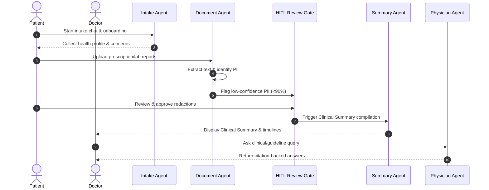

# 🔄 MedCare AI — Patient Journey Workflow

## Step-by-Step Sequence

### Detailed Workflow States
1. **Intake Chat**: Conversational onboarding collecting symptoms and gestational metadata (e.g. pregnancy week 28).
2. **OCR and Ingestion**: Automated extraction of prescriptions and lab reports (e.g. SRL Diagnostics fasting blood glucose).
3. **Anonymization & HITL**: Direct identifiers (>90% confidence) are auto-redacted. Borderline items (70-90% confidence, like doctor names) are queued for patient review.
4. **Clinical Briefing**: Synthesizes structured data, timelines, and clinical risk scores (High/Moderate/Low).
5. **Decision Support**: Doctor queries the physician assistant agent regarding medication options, lab range values, or dietary substitutions.
